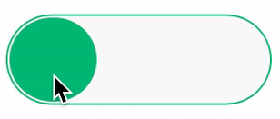

# uiSwitchjs

A simple iOS inspired switch with VanillaJS

## Installation & Usage

1. Download the ```uiSwitch.js``` & ````uiSwitch.css```` files to your working folder.
2. Add the script & stylesheet to your document as follows.
   ```html
    <link rel=stylesheet href="uiSwitch.css" type="text/css"/>
    <script src="uiSwitch.js"></script>
   ```
3. To your main script file add the following in order to make all divs with class ```uiSwitch``` to switch:
   ```javascript
   elem = document.getElementsByClassName("uiSwitch");
   uiswitch = new Array(<yourSize>);
   for (var i=0;i<elem.length;i++){
        uiswitch[i] = new uiSwitch();
        uiswitch[i].init(elem[i],<callbackFun>);
    }
   ```
   where ```<yourSize>``` is the number of elements with the class ```uiSwitch``` & ```<callbackFun>``` is the callback function called when the switch is clicked.

4. You can also select divs individually and set different callbacks for each.
5. Color change on click can be enabled by calling the ```init``` function by ```javascript init(<element>,<callbackFun>,1)```.

## Sample


## Thanks To

Chris Ferdinandi ([cferdinandi](https://github.com/cferdinandi)) - For his wonderful tutorial on VanillaJS Plugins.

Eric Sloan ([dusthazard](https://github.com/dusthazard))- For his GruuvyJs animation library.
